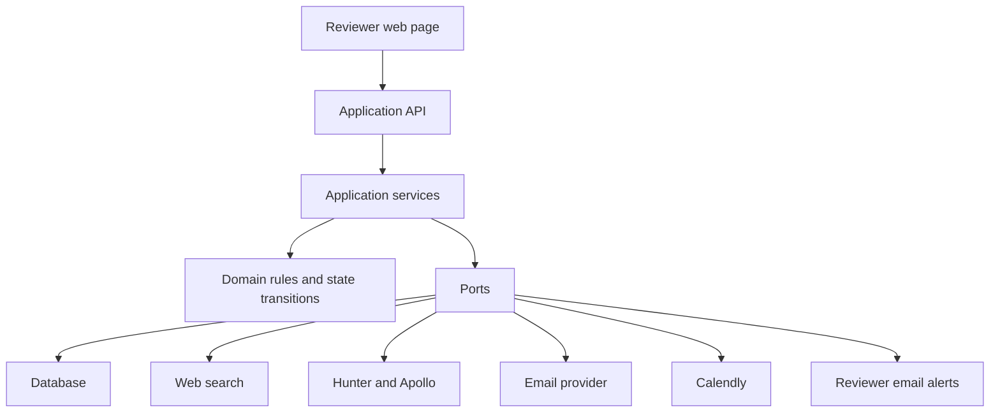
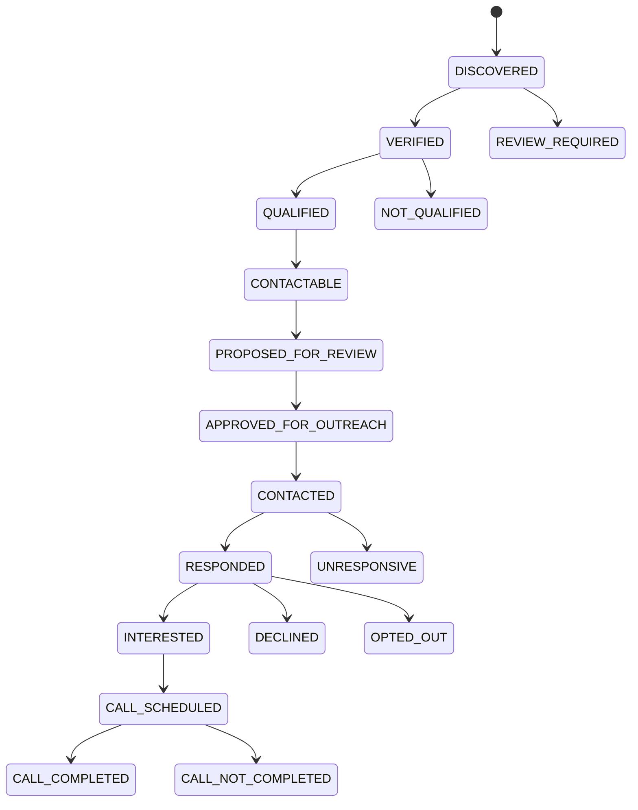

# Participant Recruiting Agent Implementation Design

## Purpose

This design turns the approved MVP scope into a modular system that can be built and tested in usable increments. Riley researches U.S. professional candidates, presents evidence and proposed actions to a reviewer, sends only approved email, schedules 30-minute calls through Calendly, and records outcomes.

The design keeps business rules independent of web, email, enrichment, calendar, database, and UI vendors. Each module has a narrow contract, can be unit tested with fakes, and can be integrated after its behavior is proven locally.

## Architectural approach

The system has four layers:



- **Domain rules and state transitions** contain no HTTP calls, database code, or UI code. They decide whether a candidate is qualified, whether an action can be proposed or executed, and how events change state.
- **Application services** coordinate use cases such as researching candidates, approving an email, processing a reply, or recording a call result.
- **Ports** are small interfaces for external capabilities. Their adapters can change without changing the domain rules.
- **API and reviewer UI** display data and invoke application services. They do not implement business rules.

The initial deployment may use the Supabase, Temporal, Python worker, email-provider, and Calendly direction in the earlier architecture. The module boundaries do not depend on those choices. Temporal is responsible for durable waiting and scheduled work; the application database is the authority for campaign and candidate facts.

## Core module map

| Module | Responsibility | Main inputs | Main outputs | Unit-test boundary |
|---|---|---|---|---|
| `domain` | Terms, entities, statuses, transitions, policy decisions | Typed commands and events | Valid state changes or rejection reasons | Pure functions and fixtures |
| `campaigns` | Create and validate study briefs and campaign targets | Study brief | Campaign record | Fake repository |
| `discovery` | Produce candidate leads from uploaded lists and web-search queries | Campaign criteria | Candidate leads with provenance | Fake search client |
| `verification` | Verify identity and professional credentials from allowed evidence | Candidate lead and source pages | Verification result and evidence | HTML/source fixtures |
| `qualification` | Evaluate criteria and rank eligible candidates | Verified candidate and campaign criteria | Qualification result and explanation | Pure fixtures |
| `enrichment` | Find and verify professional email addresses | Qualified candidate | Contact result with source and confidence | Fake Hunter/Apollo clients |
| `review` | Create pending activities and persist approval decisions | Proposed actions, reviewer decisions | Approved, rejected, or expired activities | Fake repository and clock |
| `outreach` | Draft emails, enforce cadence, execute approved sends | Candidate state, campaign, approval | Send request and interaction event | Fake email gateway and clock |
| `inbox` | Classify replies and create follow-up, cooldown, or exception events | Inbound email event | Candidate response event | Message fixtures |
| `scheduling` | Store Calendly scheduling events | Calendly webhook event | Scheduled or canceled call event | Webhook fixtures |
| `calls` | Record call occurrence, commentary, and suitability | Researcher call record | Call outcome event | Fake repository |
| `notifications` | Alert reviewer when pending actions exist | Pending-activity summary | Reviewer reminder request | Fake notifier and clock |
| `workflow` | Run durable timers and react to approved events | Domain events and due actions | Commands to application services | Deterministic fake clock and services |
| `observability` | Record audit events, costs, and campaign metrics | Domain and provider events | Traceable history and metrics | Event fixtures |

## Shared contracts

Every module exchanges typed records rather than raw provider payloads. Provider payloads are translated at the adapter boundary and stored with a versioned event type.

### Candidate evidence

```text
CandidateEvidence
  candidate_id
  criterion: name | title | seniority | industry | region | company
  observed_value
  source_type: linkedin | publication | webinar | uploaded_list | other_approved_source
  source_url
  captured_at
  confidence
```

### Candidate qualification

```text
QualificationResult
  candidate_id
  status: qualified | not_qualified | review_required
  matched_criteria[]
  missing_or_conflicting_criteria[]
  ranking_signals[]
  explanation
```

### Enrichment result

```text
ContactResult
  candidate_id
  email
  email_source: hunter | apollo | uploaded_list
  confidence
  verification_status: verified | unverified | unavailable
  provider_reference
  checked_at
```

### Reviewer activity

```text
ReviewActivity
  id
  campaign_id
  candidate_id
  type: candidate_review | email_approval | exception_review | call_outcome
  proposed_action
  evidence_snapshot
  status: pending | approved | rejected | expired | completed
  created_at
  approved_by
  approved_at
  approval_scope
```

### Outreach decision

```text
OutreachDecision
  candidate_id
  action: initial_email | reminder_1 | reminder_2 | final_reminder | stop
  due_at
  message_version
  message_body
  approval_id
  idempotency_key
```

### Candidate response and call outcome

```text
CandidateResponse
  candidate_id
  classification: interested | question | declined | opted_out | frustrated | exception
  received_at
  source_message_id
  summary

CallOutcome
  candidate_id
  scheduled_at
  occurred: true | false
  researcher_commentary
  suitable: true | false | undecided
  recorded_by
  recorded_at
```

## Deterministic policy module

The policy module is a pure, fully unit-tested gate before every proposed or executed action. It enforces:

- Evidence-based qualification before outreach is proposed.
- Individual-send approval as the default requirement.
- Any broader approval's campaign, candidate set, send limit, and expiry.
- The original email plus reminders at 3, 7, and 14 business days.
- No duplicate action with the same idempotency key.
- No send after bounce, unresponsive closure, campaign closure, an active cooldown, or another terminal restriction.
- Immediate stop and recorded timestamp for opt-out or not-interested replies.
- A six-month cooldown before a different approved message may be proposed.
- Reviewer escalation for frustrated, sensitive, legal, privacy, complaint, or ambiguous replies.

The reply classifier may suggest a classification, but the policy module determines the allowed next state. Low-confidence or ambiguous classifications become `exception_review` activities.

## State and event model

Candidate status is derived from immutable events plus the current state projection. The projection supports the reviewer UI; the event log supports auditability and replay.



Provider webhooks are first converted into normalized events, saved idempotently, then passed to the appropriate application service or workflow signal. A duplicate provider delivery must be observable but cannot produce a duplicate email or state transition.

## Reviewer web page minimum design

The UI is intentionally a separate module. Its first usable version has five views:

| View | Reviewer task |
|---|---|
| Pending actions | Inspect candidate evidence and approve or reject an individual email. |
| Candidate detail | View credentials, sources, messages, approvals, and current lifecycle state. |
| Exceptions | Decide cases with incomplete evidence, unusual replies, or other blocked actions. |
| Scheduled and past calls | View booked calls; mark occurred or not occurred; add a short commentary; record suitability. |
| Campaign progress | View target, completed conversations, candidate funnel, and pending workload. |

The UI must display the exact evidence and message that the reviewer is approving. It must never present a send as approved when the policy module would still reject it.

## Configuration

Configuration is environment-specific and must not be hard-coded in domain rules:

```text
CALENDLY_SCHEDULING_URL
DISCOVER_FIRST_IDENTITY_URL
EMAIL_SENDER_ADDRESS
HUNTER_API_KEY
APOLLO_API_KEY
EMAIL_PROVIDER_CREDENTIALS
REVIEWER_NOTIFICATION_ADDRESS
REVIEWER_ALERT_INTERVAL_HOURS=6
```

Secrets are loaded only by infrastructure adapters. Tests use fake values and must not need real provider credentials.

## Recommended MVP hosting

Use a managed three-part deployment for the first production version:

| Concern | Recommended host | Deployment unit | Why |
|---|---|---|---|
| Application database, authentication, storage, and audit records | Supabase Cloud in a U.S. region | One project | It provides managed Postgres, backups, authentication, and a direct operational interface for campaign data. |
| Durable workflow timers, signals, retries, and workflow history | Temporal Cloud | One namespace | It keeps candidate follow-ups and workflow state durable when the application worker restarts. |
| Reviewer web application, application API, inbound webhooks, and scheduled alert endpoint | Railway | One long-running web service | It deploys the Python application from the repository and exposes the authenticated reviewer UI and public provider webhook endpoints. |
| Temporal worker | Railway | One separate long-running worker service | It runs the Temporal worker continuously, independently from HTTP traffic and web-service deployments. |
| Public Discover First recruiting page | Existing `discoverfirst.co` site | Static or existing web deployment | It can evolve independently from the internal reviewer application. |

Keep the web service and the worker as separate Railway services, even if they use the same container image. The web service must stay responsive for reviewer requests and provider webhooks. The worker must remain available for Temporal polling and timer-driven actions. Railway supports persistent services for web applications, APIs, and background workers, and stores service configuration through environment variables. [Railway services](https://docs.railway.com/services)

Use Supabase as the business source of truth. It provides managed Postgres and, on paid plans, daily backups and point-in-time recovery. [Supabase database overview](https://supabase.com/docs/guides/database/overview) Do not use Supabase Edge Functions for the long-running Temporal worker: their documentation describes them as short-lived functions and directs heavy or long-running work to background workers. [Supabase Edge Functions](https://supabase.com/docs/guides/functions)

Choose U.S. regions for Supabase, Railway, and Temporal where available, and place the services in compatible U.S. regions to reduce latency. Keep all service credentials in provider-managed environment variables; do not put them in the repository or browser application.

This setup is intentionally modest: it avoids Kubernetes, self-hosted Temporal, and a separate frontend platform until usage justifies them. As the product becomes external-facing, scale the web service and worker separately, add a staging environment, and consider a dedicated secrets manager and production observability service.

## Milestones and testable increments

### Milestone 0: Foundation and contracts - Complete

Build the domain types, status transition table, policy module, repository interfaces, provider ports, fake adapters, and test fixtures. Define the database migrations without connecting real providers.

**Demonstrable result:** a local command can create a campaign and apply candidate events using only fixtures.

**Required tests:** transition-table tests, policy-table tests, schema validation, idempotency-key generation, and repository contract tests against an in-memory fake.

### Milestone 1: Campaign and candidate review - Complete

Build campaign creation, uploaded-list intake, candidate evidence storage, qualification evaluation, and the first reviewer page for candidate evidence. The reviewer can mark an uncertain candidate as included or excluded.

**Demonstrable result:** import a small fixture list, inspect evidence, and move candidates through `DISCOVERED`, `VERIFIED`, `QUALIFIED`, or `REVIEW_REQUIRED`.

**Required tests:** qualification fixtures for matches, missing evidence, conflicts, and protected-characteristic exclusion; API tests with a fake repository; browser-level tests for the candidate-review path.

### Milestone 2: Discovery and enrichment proposals

Add query construction, web-search adapters, Hunter-first/Apollo-fallback enrichment, email verification, provenance storage, and candidate-ranking proposals. No email is sent in this milestone.

**Demonstrable result:** run a campaign query in a sandbox or fixture mode and view prioritized, contactable candidates with LinkedIn and email provenance.

**Required tests:** query-generation tests, adapter translation tests using captured fixtures, fallback-order tests, and a full fake-provider test that confirms no outreach command is created.

### Milestone 3: Approval-first email

Build message drafting, individual email approvals, email send adapter, interaction log, delivery/bounce webhook normalization, and idempotent send handling. Configure Riley's sender address and public identity URL.

**Demonstrable result:** approve one fixture candidate's draft email and send it through a sandbox email provider; display the message and send result in the reviewer page.

**Required tests:** approval-policy tests, message-required-content tests, sandbox adapter test, duplicate approval test, duplicate webhook test, and end-to-end test showing an unapproved email cannot send.

### Milestone 4: Replies, reminders, and cooldowns

Add business-day scheduling, the 3/7/14 reminder sequence, inbound-reply classification, exception queue, unresponsive state, and the six-month cooldown.

**Demonstrable result:** advance a fake clock through an outreach sequence; observe reminders only after approval; submit fixture replies for interested, not-interested, opt-out, frustrated, and ambiguous cases.

**Required tests:** calendar and business-day tests, reply-classification fixtures, cooldown-boundary tests, stop-sequence tests, and workflow restart/replay tests.

### Milestone 5: Calendly and call outcomes

Add configurable Calendly link display, scheduling webhook ingestion, scheduled-call view, and researcher call-outcome recording with commentary and suitability.

**Demonstrable result:** process a sandbox Calendly booking, show it in the reviewer page, then record a completed suitable conversation.

**Required tests:** webhook-signature and idempotency tests, call-outcome validation, candidate state-transition tests, and UI tests for call recording.

### Milestone 6: Operating view and hardening

Add six-hour reviewer pending-action alerts, campaign progress, audit history, cost records, pause controls, metrics, and failure recovery.

**Demonstrable result:** run a complete sandbox campaign from candidates to recorded calls, pause it, restart its worker, and calculate X completed conversations within Y days.

**Required tests:** notification cadence tests, campaign pause tests, recovery tests, metrics-fixture tests, and a full end-to-end sandbox test with all providers faked except any intentionally selected sandbox service.

## Test strategy

Tests are grouped by boundary:

- **Unit tests:** domain transitions, policies, rankings, schedule calculations, message requirements, and reply handling. These must run without network access or a database.
- **Contract tests:** each provider adapter is tested against recorded response and webhook fixtures. A shared port test suite also runs against the fake adapter.
- **Integration tests:** migrations, repositories, event persistence, API endpoints, and workflow signals run against disposable local services.
- **End-to-end sandbox tests:** a fixture campaign exercises the reviewer approval path, fake external events, and measurable final outcomes.

No milestone depends on live candidate data to pass its test suite. Live discovery, enrichment, and email use are separate manual validation steps after the corresponding automated tests pass.

## Design decisions that can wait

These decisions do not block the first implementation design:

- The detailed visual design of the reviewer page.
- The exact content and information architecture of the public Discover First recruiting page.
- The final production email provider and worker host.
- Whether a model-based component is used for candidate ranking, reply classification, or message drafting. Each remains behind a port and must return structured, auditable results.
- A future transcription agent that joins calls. Its events can later feed the `calls` module without changing the recruitment workflow.
