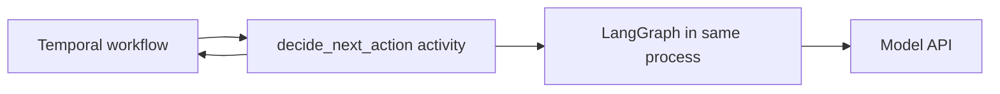
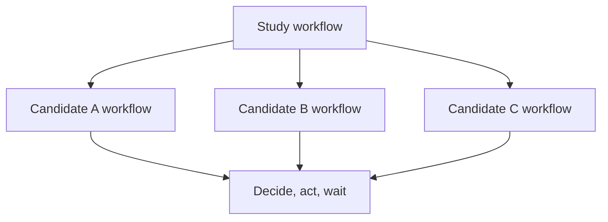
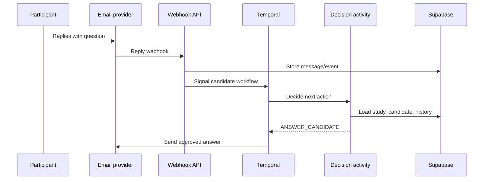

# Participant Recruiting Agent: Current Design and Architecture

## 1. Product objective

Build a participant-recruiting system for an AI interviewer that can operate autonomously within explicit legal, consent, communication, budget, and brand constraints.

Given an interview study, the system should:

1. Interpret the target participant persona.
2. Source and qualify suitable candidates.
3. Obtain valid contact information through approved sources.
4. Contact candidates through permitted channels.
5. Answer questions and handle common objections.
6. Send the interview link when appropriate.
7. Follow up without exceeding contact or consent limits.
8. Detect interview starts and completions.
9. Optimize completed interviews subject to time, monetary, token, and contact budgets.
10. Learn from campaign outcomes through controlled experiments.

The primary objective is not opens, clicks, or replies. It is **qualified completed interviews**.

---

## 2. Core design principles

### 2.1 Treat recruiting as a long-running workflow

A recruiting interaction may last days or weeks and includes timers, asynchronous replies, delivery failures, webhooks, retries, and interview events. It is better modeled as a durable workflow than as a continuous chatbot session.

### 2.2 Separate facts, execution, and judgment

- **Supabase/Postgres:** What is true about the study, candidate, and prior interactions?
- **Temporal:** What process is running, what should execute, and what are we waiting for?
- **LLM or LangGraph:** Given the current facts and allowed choices, what should happen next and what should the message say?

### 2.3 Keep deterministic constraints outside the LLM

The application—not the model—must enforce:

- Opt-outs and suppression lists
- Consent and channel eligibility
- Contact-frequency limits
- Study and campaign budgets
- Quiet hours and jurisdictional rules
- Maximum follow-ups
- Approved claims and incentives
- Stop conditions
- Idempotency and duplicate-send prevention

The model may recommend an action, but the application decides whether that action is permissible.

### 2.4 Use structured decisions

The reasoning component should return a validated decision object from a limited action set. It should not directly invoke arbitrary vendor APIs.

### 2.5 Optimize against objective outcomes

The strongest reward signal is `interview_completed`. Intermediate events such as replies or link clicks are diagnostic signals, not substitutes for completion.

### 2.6 Start with one vertical slice

Do not begin with a swarm of agents, every communication channel, or self-modifying prompts. First prove that one autonomous email loop can produce completed interviews reliably and safely.

---

## 3. Recommended component responsibilities

| Component | Responsibility | Should not own |
|---|---|---|
| Supabase | Durable business records, event history, APIs, auth, optional realtime | Workflow timers or LLM reasoning |
| Temporal | Durable execution, retries, timers, signals, workflow state, cancellation | Message strategy or business-record authority |
| LLM activity | Simple next-action decision and message generation | Timers, persistence, direct unrestricted actions |
| LangGraph | Multi-step reasoning graph when the decision process becomes complex | Campaign lifecycle or long-term source of truth |
| Email provider | Send/deliver email and produce delivery/reply webhooks | Candidate lifecycle decisions |
| Interviewer API | Create links and publish started/completed events | Recruiting orchestration |
| Sourcing/enrichment providers | Candidate discovery and permitted contact enrichment | Outreach policy or final qualification authority |
| Analytics/evaluation | Traces, funnels, datasets, experiment results, cost and outcome reporting | Operational truth for candidate state |

---

## 4. High-level architecture

```mermaid
flowchart TD
    S["Study definition"] --> T["Temporal study workflow"]
    T --> C["Temporal candidate workflows"]
    C --> D["Decision activity"]
    D --> L["LLM or LangGraph"]
    D <--> DB["Supabase / Postgres"]
    C --> X["Email and interview activities"]
    X --> P["External providers"]
    P --> W["Webhooks"]
    W --> DB
    W --> C
```



Supabase is the system of record. Temporal owns execution and waiting. The decision activity loads current facts, calls the LLM or LangGraph, validates the output, and returns a bounded decision to Temporal.

---

## 5. Deployment model

For an initial hosted prototype:

- **Supabase Cloud** for Postgres and backend services.
- **Temporal Cloud** for workflow history, timers, signals, retries, and scheduling.
- **One continuously running Python container** for the Temporal worker and recruiting application code.
- An API/webhook process may initially share the same container, although it can later scale separately.

The worker container contains ordinary Python dependencies:

```text
Python container
├── Temporal worker
├── workflow definitions
├── activities
├── LangGraph (when needed)
├── model client
├── Supabase client
├── email client
└── interview API client
```

Temporal Cloud does not run the business code. It schedules tasks and maintains durable workflow history. The application’s worker polls Temporal and executes workflow and activity code.

A continuously running container host is preferable for the worker because Temporal workers maintain long-lived polling processes. The HTTP webhook service can be serverless if desired.

Kubernetes is not necessary for the prototype.

---

## 6. Putting LangGraph inside the Temporal worker

LangGraph can be imported as a Python library in the same process as the Temporal worker. It does not require a separate LangGraph server.

The critical boundary is:

- Temporal **workflow code** must remain deterministic.
- LLM and LangGraph calls are networked and nondeterministic.
- Therefore, invoke LangGraph from a **Temporal Activity**, not directly from workflow code.



Conceptual activity:

```python
@activity.defn
async def decide_next_action(candidate_id: str) -> dict:
    context = await get_candidate_context(candidate_id)

    result = await recruiting_graph.ainvoke({
        "candidate": context["candidate"],
        "study": context["study"],
        "history": context["history"],
        "decision": {},
    })

    return validate_decision(result["decision"])
```

The workflow calls the activity:

```python
decision = await workflow.execute_activity(
    decide_next_action,
    candidate_id,
    start_to_close_timeout=timedelta(minutes=2),
)
```

This provides a clean separation: LangGraph does not need to know that Temporal exists, and Temporal receives only a structured result.

---

## 7. Current recommendation on LangGraph

LangGraph may not be needed in the first vertical slice.

Start with:

```text
Temporal workflow
    → decide_next_action activity
    → model API with structured output
    → RecruitingDecision
```

Introduce LangGraph when the decision activity itself becomes a meaningful multi-step process, for example:

1. Retrieve candidate and company research.
2. Evaluate persona fit.
3. Classify the current conversation state.
4. Detect an objection or question.
5. Retrieve applicable study and policy facts.
6. Select a response strategy.
7. Generate the message.
8. Critique it for relevance and tone.
9. Apply policy and consent checks.
10. Return a validated decision.

At that point, LangGraph provides explicit, testable reasoning flow. Before then, it may only add framework complexity.

---

## 8. Workflow hierarchy

Use two levels of Temporal workflow over time.

### StudyRecruitingWorkflow

Owns portfolio-level execution:

- Target number of completions
- Deadline
- Monetary and token budgets
- Total spend
- Candidate sourcing batches
- Active candidate concurrency
- Study completion and shutdown
- Whether to invest in existing candidates or source new ones

### CandidateRecruitingWorkflow

Owns one candidate relationship:

- Initial outreach
- Waiting for replies
- Follow-up timing
- Answering questions
- Sending the interview link
- Waiting for start or completion
- Incomplete-interview reminder
- Decline, opt-out, disqualification, and stop handling



The study workflow answers questions such as, “Should we spend more attempting to recruit this candidate, or use the budget to source additional candidates?”

---

## 9. Candidate lifecycle

Supabase should store a clear business lifecycle:

```text
DISCOVERED
→ QUALIFIED
→ CONTACTABLE
→ CONTACTED
→ RESPONDED
→ INTERESTED
→ LINK_SENT
→ STARTED
→ COMPLETED
```

Terminal or alternate outcomes include:

```text
DECLINED
OPTED_OUT
UNRESPONSIVE
DISQUALIFIED
BOUNCED
BUDGET_STOPPED
STUDY_CLOSED
```

Temporal owns what is executing or being awaited; Supabase stores the authoritative business status and history.

---

## 10. Suggested data model

### `studies`

- `id`
- `name`
- `target_persona`
- `eligibility_rules`
- `target_completions`
- `deadline`
- `monetary_budget`
- `token_budget`
- `status`
- `allowed_channels`
- `contact_policy_id`

### `candidates`

- `id`
- `study_id`
- `name`
- `company`
- `title`
- `persona_score`
- `qualification_evidence`
- `email`
- `phone`
- `contact_source`
- `consent/channel eligibility`
- `status`
- `contact_attempts`
- `last_contact_at`
- `next_action_due_at`

### `interactions`

- `id`
- `candidate_id`
- `channel`
- `direction`
- `content`
- `timestamp`
- `provider_message_id`
- `experiment_id`
- `experiment_variant`

### `interviews`

- `candidate_id`
- `link`
- `link_sent_at`
- `started_at`
- `completed_at`
- `completion_status`

### `events`

- `id`
- `study_id`
- `candidate_id`
- `event_type`
- `timestamp`
- `metadata`
- `idempotency_key`

### `decisions`

- `id`
- `candidate_id`
- `input_snapshot_reference`
- `action`
- `strategy`
- `reason`
- `confidence`
- `model/prompt version`
- `policy_result`
- `timestamp`

### `costs`

- `study_id`
- `candidate_id`
- `cost_type`
- `provider`
- `amount`
- `tokens`
- `timestamp`

---

## 11. Event model

Record meaningful events such as:

- `candidate.discovered`
- `candidate.qualified`
- `email.sent`
- `email.delivered`
- `email.bounced`
- `email.replied`
- `sms.sent`
- `sms.replied`
- `candidate.interested`
- `candidate.declined`
- `candidate.opted_out`
- `interview.link_sent`
- `interview.started`
- `interview.completed`
- `workflow.followup_due`
- `study.budget_threshold_reached`
- `study.completed`

Webhooks should first be persisted idempotently and then signal the relevant Temporal workflow. This protects against duplicate webhook delivery and preserves an audit trail.

---

## 12. Structured decision contract

An initial action set can remain deliberately small:

```text
SEND_INITIAL_EMAIL
SEND_FOLLOWUP
ANSWER_CANDIDATE
SEND_INTERVIEW_LINK
SEND_COMPLETION_REMINDER
WAIT
STOP
```

Example decision:

```json
{
  "action": "SEND_FOLLOWUP",
  "candidate_id": "candidate-123",
  "channel": "EMAIL",
  "strategy": "peer_insight",
  "experiment_id": "initial_pitch_v3",
  "variant": "B",
  "message": "...",
  "wait_hours": 72,
  "confidence": 0.81,
  "reason": "Strong persona fit and one unanswered initial contact"
}
```

Before execution, deterministic code validates:

- Action is allowed in the current state.
- Channel is permitted for this candidate.
- Candidate has not opted out.
- Follow-up and frequency limits are respected.
- Study and candidate budgets remain available.
- Message satisfies required disclosures and prohibited-claim rules.
- The send has a unique idempotency key.

---

## 13. End-to-end candidate loop

1. Study workflow sources or imports candidates.
2. Candidate facts and provenance are stored in Supabase.
3. Study workflow starts one Temporal candidate workflow per approved candidate.
4. Candidate workflow calls `decide_next_action`.
5. The activity loads current state and interaction history from Supabase.
6. The model or LangGraph returns a structured decision.
7. Policy code validates or rejects the decision.
8. Temporal executes the selected activity, such as sending an email.
9. The workflow waits for a signal or a timer.
10. A provider webhook records a reply, delivery event, interview start, or completion.
11. The webhook signals the candidate workflow.
12. The workflow wakes and asks for the next decision.
13. On completion, opt-out, decline, exhaustion, or study closure, follow-ups stop.

Example reply flow:



---

## 14. Tool and service boundaries

The reasoning layer should see business-level capabilities rather than raw vendor APIs:

```text
search_candidates(persona)
get_candidate(candidate_id)
get_interaction_history(candidate_id)
get_study_progress(study_id)
get_experiment_assignment(candidate_id)
get_interview_status(candidate_id)
record_decision(decision)
```

Execution tools should be invoked by Temporal activities after validation:

```text
send_email(candidate_id, approved_message, idempotency_key)
send_interview_link(candidate_id, idempotency_key)
mark_candidate_stopped(candidate_id, reason)
```

These business-level interfaces can later be exposed through MCP if portability across agent runtimes or providers becomes useful. MCP compatibility is valuable, but it is not required to prove the first vertical slice.

---

## 15. Technology options to evaluate

| Need | Initial option | Alternatives / notes |
|---|---|---|
| Durable orchestration | Temporal Cloud | Self-hosted Temporal later if justified |
| Database/backend | Supabase | Plain managed Postgres plus custom services |
| Initial decision logic | Direct structured model call | Add LangGraph when reasoning is multi-step |
| Agent graph | LangGraph | OpenAI Agents SDK is another runtime option |
| Candidate sourcing | Apollo | Clay and other approved data providers |
| Enrichment | Apollo/Clay | Use provenance and cost tracking |
| Email | Resend | SendGrid or Gmail/Workspace API |
| SMS/WhatsApp | Twilio | Defer until consent and channel rules are designed |
| Tracing/evaluation | Langfuse | Braintrust |
| Product analytics/experiments | PostHog | Custom assignment and reporting |
| Tool protocol | MCP-compatible interfaces | Native Python functions initially |

Vendor capabilities, policies, pricing, and regulatory requirements should be verified at implementation time.

---

## 16. Measurement and reward function

### Primary outcome

```text
qualified_interview_completed = 1
```

### Secondary funnel signals

- Delivered
- Opened, if reliably and permissibly measured
- Replied
- Positive response
- Agreed
- Link clicked
- Interview started
- Interview completed

### Costs and constraints

- Model input/output tokens
- Enrichment cost
- Email and SMS cost
- Staff review cost
- Elapsed time
- Number of contact attempts
- Candidate fatigue and complaint risk
- Bounce, spam, and opt-out rates

### Core metrics

- Qualified completion rate
- Cost per qualified completion
- Time to completion
- Messages per completion
- Tokens per completion
- Completion rate by source
- Completion rate by persona segment
- Completion rate by channel
- Completion rate by message strategy
- Opt-out, complaint, and bounce rates

A possible constrained objective is:

```text
maximize expected qualified completions
subject to:
  spend <= monetary budget
  tokens <= token budget
  time <= study deadline
  attempts <= contact-policy limits
  all consent and communication rules satisfied
```

---

## 17. Experimentation and self-improvement

Self-improvement should initially mean **measured, versioned experimentation**, not autonomous rewriting of production prompts or policies.

Examples of controlled variables:

- Candidate source
- Persona scoring threshold
- Initial value proposition
- Interview duration framing
- Incentive framing
- Subject line
- Message length
- Follow-up delay
- Number of follow-ups
- Reminder after interview start

Each candidate should receive a stable experiment assignment, and every message should record its prompt, strategy, and variant version.

Start with conventional A/B tests and adequate sample sizes. Later, consider contextual bandits for allocation across candidate × channel × message × follow-up choices. A bandit still needs hard safety constraints, delayed-reward handling, and protection against overfitting small samples.

Recommended improvement cycle:

1. Form a specific hypothesis.
2. Define variants before launch.
3. Select the primary outcome and guardrail metrics.
4. Randomly and consistently assign candidates.
5. Run until a predefined decision threshold or stopping condition.
6. Analyze completion, cost, time, and safety outcomes.
7. Promote a variant through an explicit version change.
8. Retain prior versions for comparison and rollback.

---

## 18. Safety, trust, and compliance requirements

Before expanding autonomous outreach, define:

- Source provenance and permitted use of candidate data
- Jurisdiction-aware email and texting rules
- Consent requirements by channel
- Clear sender identity
- Clear explanation of study purpose and response use
- Easy opt-out and immediate suppression
- Quiet hours and frequency caps
- Data retention and deletion policies
- Rules for incentives and compensation
- Human escalation for unusual, sensitive, or adversarial replies
- Auditability of every decision and send
- Protection against hallucinated promises or study facts
- Deliverability monitoring and automatic campaign pausing

SMS and autonomous channel switching should be deferred until consent and policy enforcement are fully implemented.

---

## 19. Proposed MVP

### Included

- One study configuration
- Imported or manually approved candidate list
- Email only
- Supabase as source of truth
- Temporal Cloud and one Python worker
- Direct structured model decision activity
- Initial email
- One or two bounded follow-ups
- Candidate-question response using approved study facts
- Interview-link delivery
- Interview-start and completion webhooks
- Incomplete-interview reminder
- Opt-out, decline, bounce, and stop handling
- Event, decision, cost, and outcome logging
- Human-readable campaign dashboard or queries

### Explicitly deferred

- Autonomous web or social-network scraping
- LinkedIn automation
- SMS and WhatsApp
- Multi-agent architecture
- Self-modifying prompts or policies
- Real-time bandit optimization
- Fully autonomous sourcing spend
- Kubernetes
- Separate LangGraph deployment
- LangGraph itself unless the decision activity becomes complex

### MVP success criteria

- The workflow survives worker restarts without losing timers or state.
- Duplicate webhooks never produce duplicate sends.
- Opt-outs stop all future contact promptly.
- Every model-selected action is validated before execution.
- The system can take a candidate from initial email to completed interview without manual orchestration.
- Completion, cost, time, and safety metrics can be calculated by study and strategy.

---

## 20. Suggested repository structure

```text
participant-recruiter/
├── app/
│   ├── main.py
│   ├── api/
│   │   └── webhooks.py
│   ├── temporal/
│   │   ├── worker.py
│   │   ├── workflows.py
│   │   └── activities.py
│   ├── decision/
│   │   ├── service.py
│   │   ├── schemas.py
│   │   ├── prompts.py
│   │   └── policies.py
│   ├── agent/
│   │   ├── graph.py
│   │   └── nodes.py
│   ├── services/
│   │   ├── supabase.py
│   │   ├── email.py
│   │   ├── interviewer.py
│   │   └── sourcing.py
│   └── observability/
│       ├── events.py
│       └── metrics.py
├── tests/
│   ├── workflow/
│   ├── activities/
│   ├── policies/
│   └── decision/
├── requirements.txt
└── Dockerfile
```

The `agent/` package can remain absent until LangGraph is justified. The `decision/` interface should remain stable whether its implementation is one model call or a graph.

---

## 21. Key architectural risks

1. **Duplicate state ownership:** Temporal, LangGraph checkpoints, and Supabase can accidentally hold conflicting versions of the candidate. Keep Supabase authoritative for business facts.
2. **Nondeterministic workflow code:** Never call models or external services directly from Temporal workflow code; use activities.
3. **Duplicate actions:** Webhook retries and activity retries can cause repeated sends unless activities use idempotency keys.
4. **Unsafe model autonomy:** A model must not bypass consent, frequency, budget, or claim constraints.
5. **Proxy-metric optimization:** Optimizing replies instead of qualified completions can degrade study quality.
6. **Small-sample overfitting:** Outreach studies may not generate enough observations for rapid strategy changes.
7. **Deliverability damage:** Excessive or poorly targeted outreach can harm domain reputation and candidate trust.
8. **Unverified persona matching:** A completion is not useful if the participant does not meet study criteria.
9. **Premature infrastructure complexity:** Multi-agent systems, Kubernetes, and a separate LangGraph server do not validate product demand.

---

## 22. Recommended implementation sequence

### Phase 1: Define contracts

- Study schema
- Candidate lifecycle
- Event taxonomy
- `RecruitingDecision` schema
- Allowed action transition table
- Contact and opt-out policies
- Interviewer webhook contract

### Phase 2: Build the deterministic skeleton

- Supabase tables and migrations
- Temporal local development environment
- Candidate workflow with mock activities
- Signals for reply, start, completion, decline, and opt-out
- Timers, retries, cancellation, and idempotency

### Phase 3: Add one real email loop

- Email send activity
- Delivery, bounce, and reply webhooks
- Interview-link creation and event webhooks
- Structured model decision activity
- Policy validator

### Phase 4: Instrument and operate

- Decision and event logging
- Cost accounting
- Funnel and completion metrics
- Manual pause/resume and campaign kill switch
- Review queue for low-confidence or sensitive situations

### Phase 5: Experiment

- Versioned outreach strategies
- Stable randomized assignment
- Predefined outcome and guardrail metrics
- Study-level allocation decisions

### Phase 6: Expand selectively

- Add LangGraph if reasoning has become multi-stage
- Add sourcing/enrichment APIs
- Add additional channels only after consent design
- Evaluate contextual optimization after sufficient data exists

---

## 23. Immediate next design artifact

The next useful artifact is the precise contract between Temporal and the decision service:

1. `RecruitingContext` input schema
2. `RecruitingDecision` output schema
3. Allowed actions
4. State-to-action transition matrix
5. Deterministic policy checks
6. Event and signal definitions
7. Retry and idempotency behavior
8. Human-review triggers

This contract will determine whether the system behaves as a controllable autonomous recruiter or an unpredictable outreach bot.
